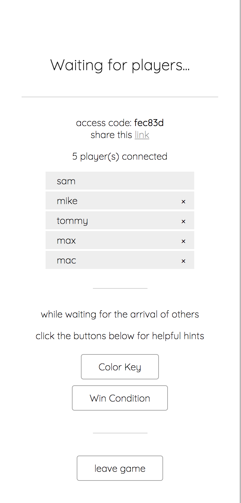
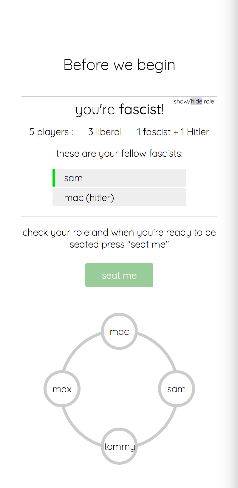
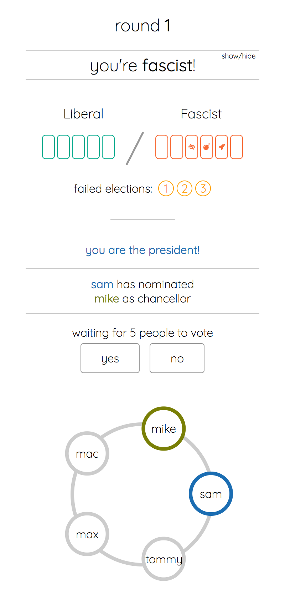
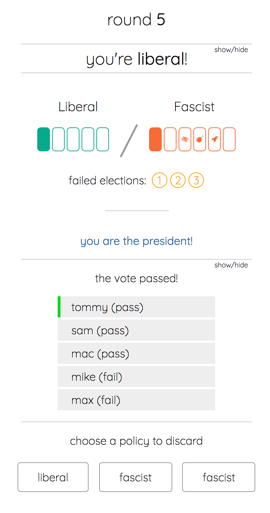

# Secret Hilter

http://www.secrethitler.party

Secret Hitler for mobile devices.

### Disclaimer

Building this so my friends and I can play this awesome board game even if we don't have the physical game.

The game and rules are not mine. All taken from the actual board game "Secret Hilter"

Secret Hilter was created by Mike Boxleiter, Tommy Maranges, Max Temkin, and Mac Schubert

I built this web app, Secret Hitler as a Meteor.js learning project. Uses MongoDB and Handlebars

[Official Rules](http://www.secrethitler.com/assets/Secret_Hitler_Rules.pdf)

## Screenshots for Mobile view

Lobby View / Seating View / Game View

   

## Technology

  - MeteorJS
  - Handlebars
  - MongoDB
  - app deployed on Heroku

### Cron used to clean up Database (remove inactive Rooms and Players)
```js
  function cleanUpDatabase() {
    // remove old rooms and players
    let cutOffTime = moment().subtract(8, 'hours').toDate().getTime();

    let numRoomsRemoved = Rooms.remove({
      createdAt: {$lt: cutOffTime}
    });

    let numPlayersRemoved = Players.remove({
      createdAt: {$lt: cutOffTime}
    });
  }

  // Cron Job to remove old rooms and players
  let MyCron = new Cron(60000);
  MyCron.addJob(5, cleanUpDatabase);
```

<!-- ## Experience while building the app

### Biggest Bugs -->
